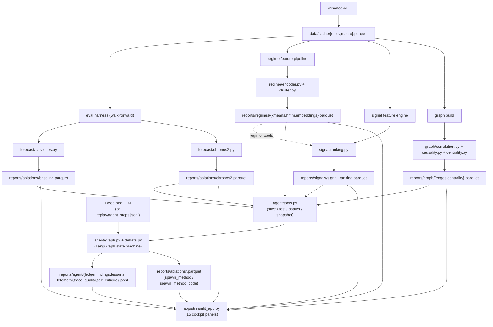

# AutoSignal-X — Architecture

Implementation reference: data flow, contracts, per-layer wiring, agent loop, sandbox model. For research questions and results see [REPORT.md](../REPORT.md); for project framing see [README.md](../README.md).

## Design principle

Each layer is independent, persists its outputs as typed parquet/JSONL artifacts under `reports/`, and reads from prior layers exclusively through those artifacts. There is no in-memory shared state between layers, and no implicit global. The cockpit and the agent are read-only consumers of the same artifacts.

Three consequences:

1. Any layer can be re-run, skipped, or replaced without touching the others.
2. The cockpit and the agent show only what is reproducible from `reports/` on disk.
3. The forecast DataFrame schema (`autosignalx.eval.contracts.FORECAST_COLUMNS_REQUIRED`) is the **load-bearing contract**. Every forecasting method satisfies it, including agent-authored methods.

## Inputs and outputs

### System inputs

| Input | Origin | Required | Persisted to |
|---|---|---|---|
| ETF OHLCV (8 tickers) | yfinance API | Yes | `data/cache/ohlcv.parquet` |
| Macro signals (4 signals) | yfinance API | Yes | `data/cache/macro.parquet` |
| Experiment hyperparameters | `configs/default.yaml` | Yes (read by every CLI) | n/a |
| DeepInfra API key | `.env` (`DEEPINFRA_API_KEY`) | No (replay mode works without) | n/a |
| Recorded LLM responses | `replay/agent_steps.jsonl` | No (auto-used in replay mode) | n/a |

### System outputs (everything persisted under `reports/`)

| Output | Path | Producer | Schema (key columns) |
|---|---|---|---|
| Per-method forecasts | `reports/ablations/<method>.parquet` | `eval/cli.py` (baseline / chronos), `agent.specs.execute`, `agent.codegen.execute_code_spec` | `(timestamp, asset, forecast_origin, horizon, method, prediction, origin_value, target, lower?, upper?)` |
| KMeans regime labels | `reports/regimes/kmeans.parquet` | `regime/cli.py` | `(timestamp, regime_id int, method "kmeans_contrastive")` |
| HMM regime labels | `reports/regimes/hmm.parquet` | `regime/cli.py` | `(timestamp, regime_id int, method "hmm_gaussian")` |
| Contrastive embeddings | `reports/regimes/embeddings.parquet` | `regime/cli.py` | `(timestamp, c0..c15)` |
| Per-regime feature ranking | `reports/signals/signal_ranking.parquet` | `signal/cli.py` | `(regime_id, feature, importance, importance_std, n_samples, rank)` |
| Cross-asset graph edges | `reports/graph/edges.parquet` | `graph/cli.py` | `(source, target, edge_type, weight, p_value?, best_lag?)` |
| Centrality | `reports/graph/centrality.parquet` | `graph/cli.py` | `(node, degree_centrality, eigenvector_centrality, betweenness_centrality)` |
| Agent ledger | `reports/agent/ledger.jsonl` | `agent.graph.run`, `agent.debate.run_debate` | `(round, step, content, ts, session_id)` |
| Promoted findings | `reports/agent/findings.jsonl` | `agent/graph.py:experiment_node` (auto-promotion) | `(id, hypothesis, method, filters, evidence, agent_confidence, round, session_id, promoted_at, parent_hypothesis_ids, replication_count, replications)` |
| Lessons (long-horizon memory) | `reports/agent/lessons.md` | `agent/cli.py:consolidate_cmd` | Markdown sections per session |
| Telemetry | `reports/agent/telemetry.jsonl` | `agent/llm.py:LiveProvider.chat` | `(ts, model, role, step, round, prompt_tokens, completion_tokens, latency_ms, cost_usd, session_id)` |
| Trace quality | `reports/agent/trace_quality.jsonl` | `agent/cli.py:score_traces_cmd` | `(round, clarity, novelty, falsifiability, evidence_citing, rationale, ts, session_id)` |
| Self-critique | `reports/agent/self_critique.jsonl` | `agent/cli.py:self_critique_cmd` | `(finding_id, current_state, rationale, ts)` |
| Generated code | `reports/agent/generated_methods/<name>.{py,json}` | `agent/codegen.py:execute_code_spec` | Python source + metadata JSON |
| Recorded LLM trace | `replay/agent_steps.jsonl` | `agent/llm.py:LiveProvider.chat` (when `record_replay=True`) | `(round, step, content)` per call |

### Information passed between layers



**Per-edge contract:** every arrow above represents a typed parquet/JSONL read; no direct in-process passing of Python objects between layers.

## Layer interfaces (artifact schemas)

### `data/cache/ohlcv.parquet`

Long format. Required columns asserted by `data/schema.py:assert_ohlcv_schema`:

```
timestamp           datetime64[ns]   trading day (no tz)
asset               string           ticker (e.g., SPY)
open / high / low / close   float64
adj_close           float64          forecast target
volume              float64
returns             float64          adj_close.pct_change()
```

Per-asset timestamps strictly monotonic increasing.

### `data/cache/macro.parquet`

```
timestamp     datetime64[ns]
signal        string           ^TNX | ^VIX | DX-Y.NYB | CL=F
value         float64
```

Per-signal timestamps strictly monotonic increasing.

### `reports/ablations/<method>.parquet` (forecast contract)

Required columns enforced by `eval/contracts.py:assert_forecast_schema`:

```
timestamp           datetime64[ns]   target trading day
asset               string
forecast_origin     datetime64[ns]   < timestamp (no leakage)
horizon             int              days from origin to target
method              string           e.g., naive, chronos2_multivariate
prediction          float64          adj_close-units
origin_value        float64          adj_close at forecast_origin
target              float64          realized adj_close
lower (optional)    float64          10% quantile
upper (optional)    float64          90% quantile
regime_id (optional) int             populated by regime.add_regime_to_forecasts
```

### `reports/regimes/`

```
kmeans.parquet      (timestamp, regime_id int, method="kmeans_contrastive")
hmm.parquet         (timestamp, regime_id int, method="hmm_gaussian")
embeddings.parquet  (timestamp, c0..c15)   contrastive embedding per window
```

Window-aligned: each `kmeans.parquet` row's `regime_id` labels the timestamp at the end of a 60-day window.

### `reports/signals/`

```
signal_ranking.parquet              Single-fit per-regime ranking
  regime_id        int
  feature          string
  importance       float    base_acc - mean shuffled_acc, n_repeats=2
  importance_std   float
  n_samples        int
  rank             int      1 = most important within the regime

walk_forward_ranking.parquet        Per-window per-regime ranking (Phase 6B)
  window_idx       int
  window_start     timestamp
  window_end       timestamp
  regime_id        int
  feature          string
  importance       float
  importance_std   float
  rank             int
  n_samples        int

signal_stability.parquet            Per-(regime, feature) summary
  regime_id        int
  feature          string
  mean_importance  float
  std_importance   float
  mean_rank        float
  rank_std         float
  n_windows        int
  topK_share       float    fraction of windows feature was rank<=K (default K=5)
  stability        float    1 - (rank_std / max_rank), clipped to [0, 1]
```

### `reports/graph/`

```
edges.parquet                       Global cross-asset graph (over full history)
  source        string   ticker
  target        string   ticker
  edge_type     string   "partial_corr" | "granger"
  weight        float64  partial corr in [-1, 1] | -log10(p) for Granger
  p_value       float64  (Granger only)
  best_lag      int      (Granger only)

centrality.parquet                  Global centrality
  node                       string
  degree_centrality          float64
  eigenvector_centrality     float64
  betweenness_centrality     float64

per_regime/regime_<id>/edges.parquet         Same machinery within regime <id>
per_regime/regime_<id>/centrality.parquet    Adds regime_id, n_samples columns

per_regime/centrality_by_regime.parquet      Long-format union of all per-regime centrality
per_regime/regime_sensitivity.parquet        Cross-regime dispersion per asset
  node                                         string
  degree_centrality_{mean,std,min,max}         float64
  eigenvector_centrality_{mean,std,min,max}    float64
  betweenness_centrality_{mean,std,min,max}    float64
  betweenness_centrality_range                 float64   max - min  (= "regime sensitivity")
```

### `reports/agent/`

```
ledger.jsonl            One JSON per step
                        (round, step, content, ts, session_id)
                        step ∈ {propose, theorist, skeptic, experiment,
                                critique, adjudicator, decide}

findings.jsonl          Promoted hypotheses (passed DM + bootstrap gate)
                        (id, hypothesis, method, filters, evidence,
                         agent_confidence, round, session_id, promoted_at,
                         parent_hypothesis_ids, replication_count, replications)

lessons.md              Markdown sections per session, --- separated
                        Used as long-horizon memory by next session

telemetry.jsonl         (ts, model, role, step, round,
                         prompt_tokens, completion_tokens, total_tokens,
                         latency_ms, cost_usd, session_id)

trace_quality.jsonl     (round, clarity, novelty, falsifiability,
                         evidence_citing, rationale, ts, session_id)

self_critique.jsonl     (finding_id, current_state, rationale, ts)
                        current_state ∈ {reinforced, unchanged,
                                          weakened, refuted}

survival.jsonl          Phase-5 hardening output, one row per finding
                        (finding_id, hypothesis, method, filters,
                         original_p, original_skill, fdr_alpha, fdr_q,
                         survives_fdr, adversarial: {full_test, placebo,
                         block_holdout, survives_adversarial},
                         survives_full_test, survives_placebo,
                         survives_block_holdout, survives_all,
                         evaluated_at)

generated_methods/      <name>.py + <name>.json
                        Sandboxed code authored at runtime + metadata

llm_cache/              content-hash-keyed plaintext (gitignored)
embed_cache/            content-hash-keyed embedding vectors (Phase 3)
```

### `replay/agent_steps.jsonl`

Pre-recorded LLM responses, one JSON per line:

```
(round int, step string, content string)
```

Used in replay mode (no API key) to walk through a recorded session deterministically.

## Layer-by-layer

### `data/`

Pulls from yfinance, normalizes to long format, persists parquet, defines walk-forward and static splits.

| File | Purpose |
|---|---|
| `schema.py` | Column contracts and `assert_*` validators |
| `cache.py` | Parquet read/write at the persistence boundary; `cache_status()` inventory |
| `fetch.py` | yfinance pulls; normalizes MultiIndex columns from yfinance |
| `splits.py` | `WalkForwardWindow` (rejects `train_end ≥ forecast_start` at construction); `StaticSplit`; `walk_forward_windows(val_end, test_end, horizon_days, step_days)` |
| `loader.py` | Wide-format pivots: `load_returns_wide()`, `load_close_wide()`, `load_macro_wide()` |
| `cli.py` | `autosignalx data fetch` / `status` |

### `eval/`

| File | Purpose |
|---|---|
| `contracts.py` | `FORECAST_COLUMNS_REQUIRED`, `assert_forecast_schema` (leakage check, non-negative horizons) |
| `metrics.py` | `mae`, `mape`, `directional_accuracy`, `skill_score`, `crps_from_quantiles` |
| `harness.py` | `run_walk_forward(method_name, forecast_fn, ohlcv, windows)`, `ablation`, `summarize`, `add_skill_score` |
| `significance.py` | `dm_test(loss_a, loss_b, horizon)` with Newey–West HAC variance; `block_bootstrap_ci`; `is_promotable` (DM + skill + bootstrap gate) |
| `fdr.py` | `benjamini_hochberg(p_values, alpha)` -- step-up FDR with monotone q-values; returns per-finding adjusted p-values + boolean survival mask |
| `adversarial.py` | `replicate_full_test`, `replicate_placebo` (shuffled regime labels), `replicate_block_holdout` (50/50 by `forecast_origin`); `adversarial_replication` bundles all three with a `survives_adversarial` rollup |
| `survival.py` | `harden_findings(findings_path, fdr_alpha)` -- joins FDR + adversarial into per-finding rows, persists `reports/agent/survival.jsonl`; `load_survival` reader |
| `cli.py` | `autosignalx eval baseline` / `chronos` / `status` (hardening is exposed under `autosignalx agent harden`) |

### `forecast/`

| File | Purpose |
|---|---|
| `baselines.py` | `naive_forecast`, `seasonal_naive_forecast(season_days=252)`, `arima_forecast(order=(1,1,1))` (on log adj_close) |
| `chronos2.py` | Lazy-loaded `Chronos2Pipeline` (cached via `lru_cache`); `chronos2_univariate`; `make_chronos2_multivariate(macro)` closure factory; `batched_ablation(method_specs, ohlcv, macro, windows, horizon_days)` for fast bulk runs |

The shared **ForecastFn contract** every method satisfies:

```python
ForecastFn = Callable[
    [pd.DataFrame, pd.Timestamp, list[pd.Timestamp]],
    pd.DataFrame  # with at least: timestamp, prediction (and optional lower/upper)
]
```

### `regime/`

| File | Purpose |
|---|---|
| `encoder.py` | `RegimeEncoder` (1D-CNN, 16-dim embedding from 60-day windows); `train_encoder` (triplet-loss training); `make_windows` (sliding-window utility) |
| `cluster.py` | `kmeans_regimes(embeddings, n_regimes, seed)`; `hmm_regimes(features, n_regimes, seed, n_iter)` |
| `labels.py` | `build_market_features` (SPY+QQQ returns + 4 macros, standardized); `fit_and_save` (orchestration); `load_regime_labels(method)`; `add_regime_to_forecasts(forecasts, method)` |
| `cli.py` | `autosignalx regime fit` / `status` |

### `signal/`

| File | Purpose |
|---|---|
| `features.py` | `compute_rsi(prices, window)`; `compute_macd_signal(prices, fast, slow, signal)`; `build_features_target(asset_ohlcv, macro_wide, horizon_days)` (8 technical + 8 macro features + binary direction target); `feature_columns(df)` |
| `ranking.py` | `_permutation_importance(predict_fn, X, y, n_repeats, seed)` (one-feature-at-a-time shuffle); `rank_features_per_regime(features_df, regime_labels, feature_cols, ...)` (HistGradientBoostingClassifier per regime) |
| `stability.py` | `walk_forward_rank(features_df, regime_labels, feature_cols, n_windows)` -- slides N windows, refits per-regime ranker inside each; `summarise_stability(walk_forward_df, top_k)` -- per-(regime, feature) stability metrics; `build_and_save(...)` orchestration |
| `cli.py` | `autosignalx signal rank` / `stability` / `status` |

### `graph/`

| File | Purpose |
|---|---|
| `correlation.py` | `partial_correlation_edges(returns, threshold)` via `sklearn.covariance.GraphicalLassoCV(cv=3)` |
| `causality.py` | `granger_edges(returns, max_lag, p_threshold)` via `statsmodels.tsa.stattools.grangercausalitytests`; takes min p across lags |
| `centrality.py` | `compute_centrality(edges, node_set, directed)` via NetworkX (degree / eigenvector / betweenness) |
| `build.py` | `build_and_save(p_threshold, max_lag, pcorr_threshold)` -- global graph orchestration |
| `per_regime.py` | `build_per_regime(...)` -- runs the same machinery within each regime's data subset; persists per-regime artifacts plus `regime_sensitivity.parquet` (cross-regime centrality dispersion); `load_per_regime`, `load_regime_sensitivity` readers |
| `cli.py` | `autosignalx graph build` / `build-per-regime` / `status` |

### `agent/`

| File | Purpose |
|---|---|
| `state.py` | `AgentState` TypedDict (round, max_rounds, ledger, context, current_*, next_action, session_id) |
| `prompts.py` | System prompts (`THEORIST_SYSTEM`, `SKEPTIC_SYSTEM`, `ADJUDICATOR_SYSTEM`, plus single-mode `PROPOSER_SYSTEM`, `CRITIC_SYSTEM`, `DECIDER_SYSTEM`) and message builders |
| `llm.py` | `LiveProvider` (DeepInfra OpenAI-compatible via `langchain_openai.ChatOpenAI`); `ReplayProvider` (recorded JSONL); content-hash response cache; per-call telemetry recording; `get_provider(record_replay, role)` factory with `ROLE_TO_ENV` mapping |
| `tools.py` | `slice_forecasts`, `test_significance`, `spawn_method`, `spawn_method_code`, `get_top_features`, `get_centrality_summary`, `context_snapshot` |
| `graph.py` | `build_agent_graph` (single-LLM mode); `experiment_node` (handles all 3 experiment types + auto-promotion); `run(max_rounds, seed, record_replay, session_id)` |
| `debate.py` | `build_debate_agent_graph` (4-node-per-round multi-role mode); `run_debate(...)` |
| `specs.py` | Constrained DSL for `spawn_method`: `validate_spec`, `_build_forecast_fn`, `execute(spec, config_name)` |
| `codegen.py` | Sandboxed Python for `spawn_method_code`: `validate_code` (AST walk), `compile_forecast_fn`, `execute_code_spec(spec)` |
| `ledger.py` | `append`, `load`, `clear`, `summarize_for_prompt(entries, limit)` |
| `findings.py` | `promote(...)` (idempotent on hypothesis+method+filters; bumps `replication_count` and appends to `replications` list); `_finding_id(content)` (content-hash); `make_session_id()` (sortable `YYYYMMDD-<hex>`) |
| `lineage.py` | `hypothesis_id(content)` (content-hash); `build_lineage(ledger_entries, finding_records, parent_lookback, overlap_threshold)`; `lineage_dataframe(lineage)` |
| `memory.py` | `consolidate(session_id, ledger, findings, provider)` (LLM-driven); `append_to_lessons`; `load_lessons(max_chars)` (tail-truncated read keeping section breaks) |
| `trace_eval.py` | LLM-as-judge per-round scoring on 4 rubrics (clarity / novelty / falsifiability / evidence_citing) |
| `self_critique.py` | LLM-as-judge re-evaluation of past findings; verdict ∈ {reinforced, unchanged, weakened, refuted} |
| `telemetry.py` | `record_call(...)`, `estimate_cost_usd`, `model_prices(model_id)` (env-var override > defaults > fallback), `CallTimer` (wall-clock context manager) |
| `sessions.py` | `list_sessions`, `session_summary(sid)`, `all_summaries`, `productivity_trend` (cumulative findings + cost) |
| `cli.py` | `autosignalx agent run [--mode single\|debate]` / `score-traces` / `consolidate` / `self-critique` / `status` |

## Agent loop

### Single-LLM mode (`agent/graph.py:build_agent_graph`)

```
START → propose → experiment → critique → decide → [propose | END]
```

One LLM model handles all three reasoning steps. `decide` either continues (if not at `max_rounds`) or stops; conditional edge dispatches.

### Debate mode (`agent/debate.py:build_debate_agent_graph`)

```
START → Theorist → Skeptic → experiment → Adjudicator → [Theorist | END]
```

Three different DeepInfra models play three roles (env-configurable):

| Role | Default model | System prompt theme |
|---|---|---|
| Theorist | `moonshotai/Kimi-K2.6` | Propose specific, mechanistically motivated hypotheses |
| Skeptic | `zai-org/GLM-5.1` | Identify confounders / alternative explanations *before* the experiment runs |
| Adjudicator | `deepseek-ai/DeepSeek-V4-Pro` | Weigh proposal vs challenge against experiment result; verdict ends with `VERDICT: support \| refute \| inconclusive` |

Each LLM-touching node writes its own ledger entry (`step ∈ {theorist, skeptic, adjudicator}`).

### Experiment node (shared across modes)

`experiment_node` in `agent/graph.py` branches on `state.current_hypothesis.experiment.type`:

| Type | Action |
|---|---|
| `slice_forecasts` | Filter cached forecasts by `(method, asset, regime_id)`; compute metrics. |
| `spawn_method` | Validate spec (`agent/specs.py`), build composed `ForecastFn` from primitives, run walk-forward (capped windows), persist to `reports/ablations/<name>.parquet`. |
| `spawn_method_code` | AST-validate Python (`agent/codegen.py`), compile in restricted globals, run walk-forward (capped windows), persist code + metadata + forecasts. |

**Auto-promotion** after every non-naive method experiment: call `test_significance(method, baseline="naive", asset, regime_id)`. If `promotable: True`, append to `reports/agent/findings.jsonl` with full evidence and provenance.

## DSL spec for `spawn_method` (`agent/specs.py`)

```json
{
  "name": "<alphanumeric_with_underscores_or_dashes>",
  "base": "naive | arima | chronos2_univariate | chronos2_multivariate",
  "covariate_subset": ["DX-Y.NYB"],            // optional; only chronos2_multivariate
  "ensemble_naive_weight": 0.3,                // [0, 1]; 0 = pure base, 1 = pure naive
  "max_windows": 8,                            // cap for fast iteration
  "asset_subset": ["SPY", "EFA"]               // optional asset filter
}
```

`validate_spec` rejects bad names, unknown bases, malformed covariate subsets, out-of-range ensemble weights, bad max_windows, with specific error messages — before any code runs.

## Sandbox model (`agent/codegen.py`)

For `spawn_method_code`:

1. **AST validation** rejects:
   - Imports of any module not in `ALLOWED_IMPORTS = {numpy, pandas, math}`.
   - References to forbidden names: `exec`, `eval`, `compile`, `__import__`, `open`, `input`, `globals`, `locals`, `vars`, `getattr`, `setattr`, `delattr`, `hasattr`, `exit`, `quit`, `breakpoint`, `help`.
   - Dunder attribute access (`x.__class__`, etc.).
   - Code length > 8000 characters.

2. **Restricted globals** (`_safe_globals`): a curated `__builtins__` dict (range, len, abs, min/max/sum, sorted, ...) plus `np`, `pd`, `math` aliases. Custom `__import__` resolves only `ALLOWED_IMPORTS`.

3. **Function-shape check**: the compiled module must define a callable named `forecast_fn`.

4. **Persistence**: generated source → `reports/agent/generated_methods/<name>.py`; metadata → `<name>.json`. Forecasts go to `reports/ablations/<name>.parquet` like any other method.

This is a **soft** boundary suitable for trusted (author-controlled) prompts. It is **not** a security boundary against adversarial Python; production hardening would require OS-level isolation (firejail / gVisor / WASM) or process separation.

## Cockpit reader pattern (`app/streamlit_app.py`)

A flat module registering 15 panel render functions in a `PANELS` dict, dispatched by sidebar selection. Every panel is a read-only reader over `reports/`:

| Panel | Reads |
|---|---|
| Overview | `__version__`, `settings` |
| Data | `data/cache/*.parquet` (via `data.cache.cache_status` and `data.loader.load_*_wide`) |
| Forecast Arena | `reports/ablations/*.parquet` (concat); optionally `reports/regimes/kmeans.parquet` for stratification |
| Regime Explorer | `reports/regimes/{kmeans,hmm,embeddings}.parquet` |
| Signal Discovery Lab | `reports/signals/*.parquet` (most recent by mtime) |
| Cross-Asset Graph | `reports/graph/{edges,centrality}.parquet` |
| Agent Console | `reports/agent/ledger.jsonl`, `reports/agent/trace_quality.jsonl` |
| Auto-Play Replay | `reports/agent/ledger.jsonl` (with `st.session_state` for playback) |
| Findings | `reports/agent/findings.jsonl` |
| Lineage | `reports/agent/ledger.jsonl` + `findings.jsonl` (DAG inferred via `lineage.build_lineage`) |
| Self-Critique | `reports/agent/self_critique.jsonl` |
| Lessons & Memory | `reports/agent/lessons.md` |
| Telemetry | `reports/agent/telemetry.jsonl` |
| Sessions | All stores, aggregated by `session_id` via `agent/sessions.py` |
| Ask the Memory | `reports/agent/ledger.jsonl` + LLM (live mode) or keyword search (replay mode) |

No panel computes heavy work; expensive computation lives in CLI commands and is persisted to `reports/`.

## Adding a new layer

1. `src/autosignalx/<layer>/__init__.py` exposing the public API.
2. Define output schema as a parquet (or JSONL) under `reports/<layer>/`.
3. Per-concern modules (e.g., `model.py`, `infer.py`).
4. `<layer>/cli.py` defining a `typer.Typer`; register in `src/autosignalx/cli.py` via `app.add_typer(<layer>_app, name="<layer>")`.
5. Makefile target.
6. Streamlit panel: render function appended to `PANELS` in `app/streamlit_app.py`.
7. Tests in `tests/test_<layer>.py`.
8. If the agent should consume the new artifact: add a tool in `agent/tools.py` that loads it; bundle it into `context_snapshot()`.

## Scheduled execution

`scripts/run_session.sh` (bash, cron-compatible) and `scripts/run_session.ps1` (PowerShell, Windows Task Scheduler) wrap a full session: `agent run --mode debate --record-replay` → `agent score-traces` → `agent consolidate`. Configurable via `AUTOSIGNALX_ROUNDS` and `AUTOSIGNALX_MODE` env vars.

Cron example:

```
0 3 * * * cd /path/to/repo && bash scripts/run_session.sh >> reports/agent/cron.log 2>&1
```

Cross-session aggregation in `agent/sessions.py` (`list_sessions`, `session_summary(sid)`, `all_summaries`, `productivity_trend`) produces per-session and cumulative views in the Sessions cockpit panel.
