# AutoSignal-X — Architecture

> Factual implementation reference. How the layers fit together, what
> contracts they share, how data flows from raw fetch to the cockpit
> and the agent. For findings narrative see [REPORT.md](../REPORT.md);
> for project framing see [README.md](../README.md).

## Design principle

Each layer is **independent**, **persists its outputs as typed parquet/JSONL artifacts** under `reports/`, and **reads from prior layers via those artifacts** — never via in-memory state. Three consequences:

1. You can run, re-run, or skip any single layer without touching the others.
2. The cockpit and the agent are **thin readers** over the same artifacts; everything they show is reproducible from `reports/` alone.
3. Iteration boundaries (`iter-N-*` branches in git history) line up with layer boundaries, because each iteration adds a new layer + writes its artifact contract + adds a Streamlit panel that reads from it.

The forecast DataFrame schema (`autosignalx.eval.contracts.FORECAST_COLUMNS_REQUIRED`) is the **load-bearing contract**: every forecasting method (baselines, Chronos-2, future regime-conditional ensembles) emits frames matching it. Regime labels, signal rankings, graph edges, and agent ledger entries are the supporting contracts.

---

## Data flow

```mermaid
flowchart TD
  YF["yfinance API"] --> DC["data/cache/&#123;ohlcv,macro&#125;.parquet"]
  DC --> EH["eval harness (walk-forward)"]
  DC --> RFP["regime feature pipeline"]
  DC --> SFP["signal feature engine"]
  DC --> GFP["graph build"]

  EH --> BL["forecast/baselines.py<br/>(naive, seasonal, ARIMA)"]
  EH --> CH["forecast/chronos2.py<br/>(univariate + multivariate)"]
  BL --> AB["reports/ablations/baseline.parquet"]
  CH --> AB2["reports/ablations/chronos2.parquet"]

  RFP --> RE["regime/encoder.py<br/>(contrastive 1D-CNN)"]
  RE --> KM["regime/cluster.py<br/>(KMeans on embeddings)"]
  RFP --> HM["regime/cluster.py<br/>(HMM on raw features)"]
  KM --> RL["reports/regimes/kmeans.parquet<br/>+ embeddings.parquet"]
  HM --> RL2["reports/regimes/hmm.parquet"]

  SFP --> SR["signal/ranking.py<br/>(HistGradBoost + perm imp.)"]
  RL -.regime labels.-> SR
  SR --> SS["reports/signals/signal_ranking.parquet"]

  GFP --> GLA["graph/correlation.py<br/>(GLASSO partial-corr)"]
  GFP --> GR["graph/causality.py<br/>(Granger tests)"]
  GLA --> GE["reports/graph/edges.parquet"]
  GR --> GE
  GE --> CE["graph/centrality.py<br/>(NetworkX)"]
  CE --> CT["reports/graph/centrality.parquet"]

  AB --> AG["agent/tools.py<br/>(slice_forecasts,<br/> context_snapshot)"]
  AB2 --> AG
  RL --> AG
  SS --> AG
  CT --> AG

  AG --> SM["agent/graph.py<br/>(LangGraph state machine)"]
  LLM["DeepInfra LLM<br/>(or replay/agent_steps.jsonl)"] --> SM
  SM --> LJ["reports/agent/ledger.jsonl"]

  AB --> CK["app/streamlit_app.py<br/>(cockpit, 8 panels)"]
  AB2 --> CK
  RL --> CK
  SS --> CK
  GE --> CK
  CT --> CK
  LJ --> CK
```



`reports/` artifacts are committed to the repo, so the cockpit and agent both work out-of-the-box on a fresh clone.

---

## Contracts

These are the typed boundaries between layers. Every layer reads against the contracts; tests assert them; schema violations raise at the persistence boundary (`cache.write_*`, `harness.run_walk_forward`).

### OHLCV (data layer output, all subsequent layers' input)

`autosignalx.data.schema.OHLCV_COLUMNS`

| column | type | semantics |
|---|---|---|
| `timestamp` | `datetime64[ns]` | trading day (no tz) |
| `asset` | `string` | ticker (e.g., `SPY`) |
| `open`/`high`/`low`/`close` | `float64` | raw OHLC |
| `adj_close` | `float64` | adjusted close (target of forecasts) |
| `volume` | `float64` | shares traded |
| `returns` | `float64` | `adj_close.pct_change()` |

Long format. Per-asset, timestamps are strictly monotonic increasing (asserted in `assert_ohlcv_schema`).

### Macro

`autosignalx.data.schema.MACRO_COLUMNS`

| column | type | semantics |
|---|---|---|
| `timestamp` | `datetime64[ns]` | trading day |
| `signal` | `string` | symbol (e.g., `^VIX`, `^TNX`, `DX-Y.NYB`, `CL=F`) |
| `value` | `float64` | level |

### Forecast (the load-bearing contract)

`autosignalx.eval.contracts.FORECAST_COLUMNS_REQUIRED`

| column | type | semantics |
|---|---|---|
| `timestamp` | `datetime64[ns]` | target day the forecast is **for** |
| `asset` | `string` | ticker |
| `forecast_origin` | `datetime64[ns]` | day the forecast was **made**; must be `< timestamp` (no leakage) |
| `horizon` | `int` | days from origin to target |
| `method` | `string` | identifier (e.g., `naive`, `chronos2_multivariate`) |
| `prediction` | `float64` | point forecast in `adj_close` units |
| `origin_value` | `float64` | `adj_close` at `forecast_origin` (used for directional metrics) |
| `target` | `float64` | realized `adj_close` at `timestamp` |

Optional columns (`FORECAST_COLUMNS_OPTIONAL`): `lower`, `upper` (interval bounds for probabilistic methods), `regime_id` (joined post-hoc).

`assert_forecast_schema` enforces required columns + leakage check + non-negative horizons. Every commit of a new forecasting method passes this, so downstream consumers (metrics, cockpit, agent) read uniformly across methods.

### Regime labels

`autosignalx.regime.labels.load_regime_labels(method)` returns:

| column | type | semantics |
|---|---|---|
| `timestamp` | `datetime64[ns]` | day |
| `regime_id` | `int` | regime label (0..n-1) |
| `method` | `string` | `"kmeans_contrastive"` or `"hmm_gaussian"` |

Joined into forecasts on `forecast_origin → timestamp` via `regime.labels.add_regime_to_forecasts`.

### Signal ranking

`reports/signals/signal_ranking.parquet`:

| column | type | semantics |
|---|---|---|
| `regime_id` | `int` | which regime this row applies to |
| `feature` | `string` | feature name (e.g., `momentum_60`, `macro_^VIX_level`) |
| `importance` | `float` | base_acc − mean(shuffled_acc) over `n_repeats` permutations |
| `importance_std` | `float` | std of the above across repeats |
| `n_samples` | `int` | rows used to fit the per-regime classifier |
| `rank` | `int` | 1 = most important within the regime |

### Graph edges

`reports/graph/edges.parquet` (mixed undirected + directed):

| column | type | semantics |
|---|---|---|
| `source` / `target` | `string` | node tickers |
| `edge_type` | `string` | `"partial_corr"` (undirected) or `"granger"` (directed) |
| `weight` | `float` | partial correlation in [−1, 1], or `−log10(p)` for Granger |
| `p_value` | `float` (Granger only) | minimum p across lags |
| `best_lag` | `int` (Granger only) | lag that gave the minimum p |

### Centrality

`reports/graph/centrality.parquet`: `(node, degree_centrality, eigenvector_centrality, betweenness_centrality)`.

### Agent ledger

`reports/agent/ledger.jsonl` (append-only, one JSON per line):

```json
{"round": 4, "step": "propose", "content": {"hypothesis": "...", "experiment": {"type": "slice_forecasts", "params": {...}}}, "ts": "2026-04-25T22:55:13+00:00"}
```

`step` ∈ `{"propose", "experiment", "critique", "decide"}`. The `content` shape varies by step (dict for propose/experiment/decide, string for critique).

---

## Per-layer wiring

Every layer follows the same five-piece pattern: **library code** ⟶ **CLI subcommand** ⟶ **Makefile target** ⟶ **artifact persisted under `reports/`** ⟶ **Streamlit panel reads it back**. Each layer registers its CLI sub-app via `app.add_typer(...)` in `src/autosignalx/cli.py`, so the top-level `autosignalx` command discovers everything.

### Iter 1 — Data layer (`src/autosignalx/data/`)

| concern | file |
|---|---|
| schema + assertions | `schema.py` |
| parquet I/O | `cache.py` |
| yfinance pulls | `fetch.py` |
| walk-forward / static splits | `splits.py` |
| convenience pivots | `loader.py` |
| `autosignalx data fetch` / `status` | `cli.py` |

Run: `make data` → `data fetch` → writes `data/cache/{ohlcv,macro}.parquet`. Cockpit panel: **Data**.

### Iter 2 — Evaluation harness (`src/autosignalx/eval/`)

| concern | file |
|---|---|
| forecast contract + `assert_forecast_schema` | `contracts.py` |
| MAE, MAPE, dir-acc, skill, CRPS | `metrics.py` |
| `run_walk_forward`, `ablation`, `summarize`, `add_skill_score` | `harness.py` |
| `autosignalx eval baseline` / `chronos` / `status` | `cli.py` |

The harness defines the `ForecastFn` callable contract:

```python
ForecastFn = Callable[
    [pd.DataFrame, pd.Timestamp, list[pd.Timestamp]],
    pd.DataFrame,  # cols: timestamp, prediction (+ optional lower/upper)
]
```

Every forecasting method satisfies it. The harness wraps it with the (window, asset) loop and the join-with-realized-target step.

### Iter 3 — Forecasting layer (`src/autosignalx/forecast/`)

| concern | file |
|---|---|
| naive / seasonal / ARIMA | `baselines.py` |
| Chronos-2 univariate, multivariate (via past_covariates), batched ablation runner | `chronos2.py` |

Chronos-2 is loaded once per session via `functools.lru_cache`. The `batched_ablation` function bypasses the per-call harness loop and feeds 700+ inputs to one `predict_quantiles` call, amortizing the model's forward-pass cost.

Outputs: `reports/ablations/baseline.parquet`, `reports/ablations/chronos2.parquet`. Cockpit panel: **Forecast Arena**.

### Iter 4 — Representation layer (`src/autosignalx/regime/`)

| concern | file |
|---|---|
| 1D-CNN encoder + triplet-loss training | `encoder.py` |
| KMeans on embeddings, Gaussian HMM on raw features | `cluster.py` |
| market features + orchestration + persistence | `labels.py` |
| `autosignalx regime fit` / `status` | `cli.py` |

`labels.fit_and_save(...)` runs end-to-end: builds the SPY/QQQ + macro feature matrix, standardizes, trains the encoder for 25 epochs with triplet loss (positive=adjacent window, negative=distant window), runs KMeans on embeddings, runs HMM on raw features, persists three parquets.

Outputs: `reports/regimes/{kmeans,hmm,embeddings}.parquet`. Cockpit panel: **Regime Explorer**.

### Iter 5 — Reasoning layer (`src/autosignalx/signal/`)

| concern | file |
|---|---|
| RSI, MACD, technical + macro features, target | `features.py` |
| per-regime classifier fit + permutation importance | `ranking.py` |
| `autosignalx signal rank` / `status` | `cli.py` |

`ranking.rank_features_per_regime(features_df, regime_labels, ...)`:
1. Joins features with regime labels on timestamp.
2. For each regime: subsamples to ≤ N rows, fits `HistGradientBoostingClassifier(max_iter=200, lr=0.05, max_depth=4)`.
3. Custom permutation importance: shuffle one feature at a time, measure accuracy drop, repeat.

Outputs: `reports/signals/signal_ranking.parquet`. Cockpit panel: **Signal Discovery Lab**.

### Iter 6 — Relational layer (`src/autosignalx/graph/`)

| concern | file |
|---|---|
| GLASSO partial correlations | `correlation.py` |
| Granger causality between asset pairs | `causality.py` |
| NetworkX-based degree / eigenvector / betweenness | `centrality.py` |
| orchestration (load returns, build all, persist) | `build.py` |
| `autosignalx graph build` / `status` | `cli.py` |

Outputs: `reports/graph/{edges,centrality}.parquet`. Cockpit panel: **Cross-Asset Graph**.

### Iter 7 — Agentic layer (`src/autosignalx/agent/`)

The agent is the only layer that *consumes* every other layer's artifacts and that *writes its own structured memory*. See [Agent loop](#agent-loop) below for detail.

| concern | file |
|---|---|
| TypedDict for the LangGraph state | `state.py` |
| append-only JSONL persistence + summary | `ledger.py` |
| deterministic experiment tools (slice, snapshot, lookups) | `tools.py` |
| LiveProvider (DeepInfra) + ReplayProvider | `llm.py` |
| system + user prompt builders | `prompts.py` |
| LangGraph StateGraph, nodes, routing | `graph.py` |
| `autosignalx agent run` / `status` | `cli.py` |

Outputs: `reports/agent/ledger.jsonl`, `replay/agent_steps.jsonl`. Cockpit panels: **Agent Console**, **Ask the Memory**.

---

## Agent loop

The agent is a **LangGraph** state machine over five nodes:

```
START ─▶ propose ─▶ experiment ─▶ critique ─▶ decide ─┬─▶ propose (if continue)
                                                       └─▶ END (if stop)
```

### State

`AgentState` (TypedDict in `agent/state.py`):

```python
{
    "round": int,                   # current round (0-indexed)
    "max_rounds": int,              # hard cap
    "ledger": list[dict],           # accumulating in-memory mirror of ledger.jsonl
    "context": dict,                # tools.context_snapshot() at run start
    "current_hypothesis": dict,     # last propose output
    "current_critique": str,        # last critique output
    "current_experiment": dict,     # last experiment result
    "next_action": "continue" | "stop",
}
```

### Per-node responsibility

| Node | Reads | Calls | Writes |
|---|---|---|---|
| `propose` | `state.context`, `summarize_for_prompt(ledger)` | LLM (proposer model) | hypothesis JSON → ledger + state |
| `experiment` | `state.current_hypothesis.experiment` | `tools.slice_forecasts(...)` (deterministic) | metrics JSON → ledger + state |
| `critique` | hypothesis + experiment | LLM (critic model) | critique string → ledger + state |
| `decide` | ledger summary | LLM (decider model, or hard-stop on `max_rounds`) | `{"action", "reason"}` → ledger + `state.next_action` |

### Tool surface (`agent/tools.py`)

What the experiment node can do:

- `slice_forecasts(method=None, asset=None, regime_id=None) → {n_total_rows, per_method: [{method, n, mae, mape, dir_acc, crps, skill_vs_naive}, ...]}`
  Joins `forecast_origin → regime_id` using `reports/regimes/kmeans.parquet`, then filters and computes the standard metric set on the slice.
- `get_top_features(regime_id, top_k=5) → list[{feature, importance, rank}]`
  Reads from `reports/signals/signal_ranking.parquet`.
- `get_centrality_summary() → dict[asset → {degree, eigenvector, betweenness}]`
  Reads from `reports/graph/centrality.parquet`.
- `context_snapshot() → dict` — bundles all of the above + `list_methods/assets/regimes` into a single dict that seeds the proposer prompt at run start.

By design, **all experiments are descriptive** (slicing cached forecasts), not causal (no fit-on-the-fly). This is documented as a limitation in REPORT.md Iter 9. Adding a `fit_method_on_slice` tool that retrains a model under specific (regime, feature-subset) constraints is the natural next step.

### LLM provider (`agent/llm.py`)

Two implementations of the same `LLMProvider` Protocol:

- **`LiveProvider`**: wraps `langchain_openai.ChatOpenAI` pointed at DeepInfra's OpenAI-compatible endpoint. Hashes the message list (SHA-256) and caches the response on disk under `reports/agent/llm_cache/`, so re-runs of the same prompt are free and deterministic. Optionally appends every response to `replay/agent_steps.jsonl` (when `--record-replay` is set on the CLI).
- **`ReplayProvider`**: reads pre-recorded responses from `replay/agent_steps.jsonl`, keyed by `(round, step)`. If a key is missing, returns a deterministic plausible fallback (defined in `_fallback_response`) so the loop keeps running and produces a structured trace even on a sparse replay.

`get_provider(record_replay=False)` is the factory: returns `ReplayProvider` if `settings.use_replay` is true (= `AUTOSIGNALX_REPLAY=true` or no API key); otherwise `LiveProvider`.

### Why this composition matters

A reviewer cloning the repo without a DeepInfra key gets the same agent walkthrough as a reviewer with a key, because `replay/agent_steps.jsonl` is committed and contains the recorded live session. The Streamlit `Agent Console` panel reads `reports/agent/ledger.jsonl` either way; the `Ask the Memory` panel switches between LLM-answered (live) and keyword-search (replay) at render time based on `settings.use_replay`.

---

## Cockpit (`app/streamlit_app.py`)

A flat module that registers eight panel render functions in a `PANELS` dict and dispatches by sidebar selection. Every panel is a **read-only reader** over `reports/`:

| Panel | Reads |
|---|---|
| Overview | `__version__`, `settings` |
| Data | `data/cache/*.parquet` (via `data.cache.cache_status` and `data.loader.load_*_wide`) |
| Forecast Arena | `reports/ablations/*.parquet` (concat of all), optionally `reports/regimes/kmeans.parquet` for stratification |
| Regime Explorer | `reports/regimes/{kmeans,hmm,embeddings}.parquet` |
| Signal Discovery Lab | `reports/signals/*.parquet` (most recent by mtime) |
| Cross-Asset Graph | `reports/graph/{edges,centrality}.parquet` |
| Agent Console | `reports/agent/ledger.jsonl` |
| Ask the Memory | `reports/agent/ledger.jsonl` + `agent.llm.get_provider()` (live) or keyword search (replay) |

Adding a panel: define `render_<name>() -> None`, append `"<Panel name>": render_<name>` to `PANELS`. Panels never compute heavy work — all expensive computation happens in the per-layer CLI commands and is persisted to `reports/`.

---

## Adding a new layer

The repository is structured to make this a templated change. To add a hypothetical L6:

1. **Create the package**: `src/autosignalx/<layer>/__init__.py` exposing the public API.
2. **Define the output schema**: a parquet (or JSONL) under `reports/<layer>/` with documented columns.
3. **Write the core**: per-concern modules (e.g., `model.py`, `infer.py`).
4. **Write the CLI subcommand**: `<layer>/cli.py` defining a `typer.Typer` instance, registered in `src/autosignalx/cli.py` via `app.add_typer(<layer>_app, name="<layer>")`.
5. **Add a Makefile target**: one line that calls the CLI subcommand.
6. **Add a Streamlit panel**: a single render function appended to `PANELS` in `app/streamlit_app.py`.
7. **Add tests**: `tests/test_<layer>.py` with unit tests against synthetic inputs.
8. **Append a section to REPORT.md** with methodology + findings.
9. **Update the agent's tool surface** (`agent/tools.py`) if the new layer's artifact should be readable by the agent — add a function that loads it and bundle it into `context_snapshot()`.
10. **Branch + merge `--no-ff`**: develop on `iter-N-<theme>`, merge into the integration branch with `--no-ff` to preserve the boundary.

Steps 1–8 are local to the layer; step 9 is the only cross-cutting hook. Step 10 keeps the version-control story coherent.

---

## Known limitations referenced from the architecture

- **All agent experiments are descriptive (slicing cached forecasts), not causal (re-fitting models per-hypothesis).** The agent's `slice_forecasts` tool computes metrics on cached data; adding a `fit_method_on_slice` tool that retrains under hypothesis-specific constraints is a natural extension that would let the agent run causal experiments inside the same LangGraph loop.
- **The forecast contract assumes price-level targets (`adj_close`).** Returns-based targets and risk-adjusted metrics (Sharpe, Sortino) would extend the contract with optional columns.
- **The signal layer fits on a *random* subsample per regime.** A walk-forward variant that fits per (regime, training-window) and ranks features per training window is a natural extension.
- **Cross-asset graph is global, not per-regime.** Computing partial-correlation graphs *within* each regime would expose regime-conditional structural changes (and is straightforward — pass `returns[regime_mask]` instead of `returns`).

---

For the *what we found* narrative, see [REPORT.md](../REPORT.md). For the *why* and the project framing, see [README.md](../README.md).
